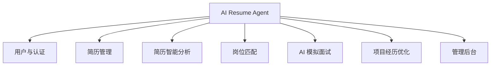
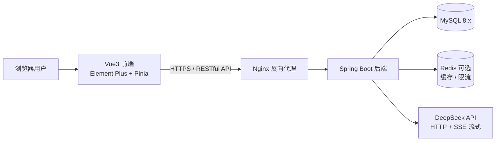
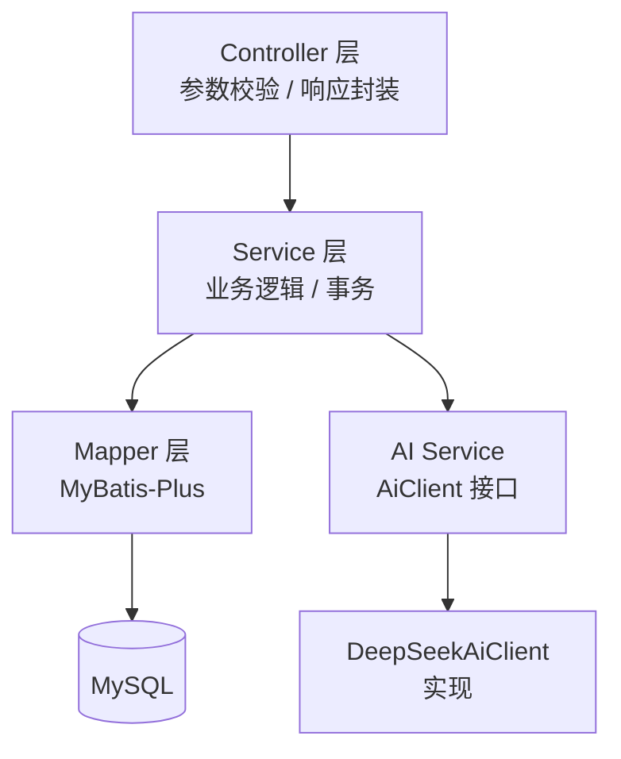
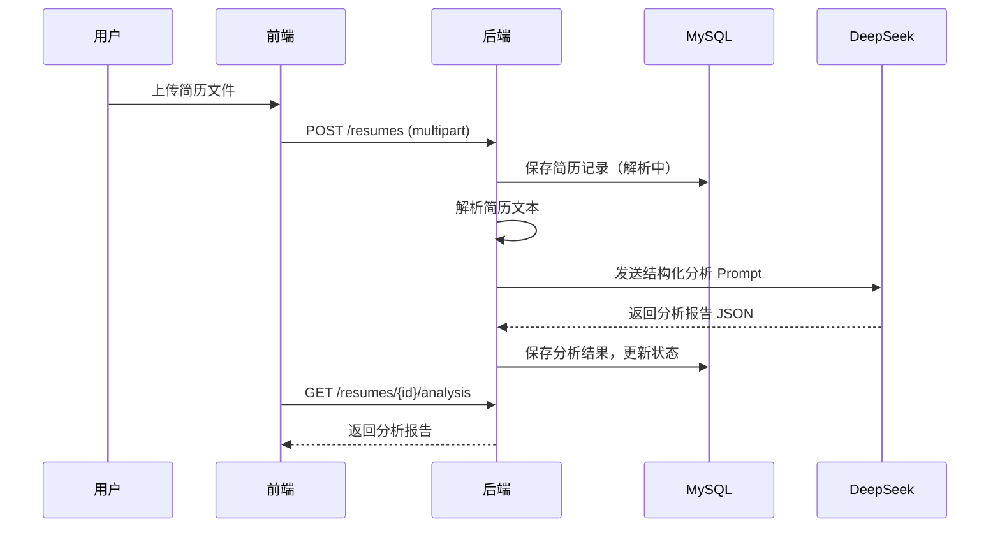
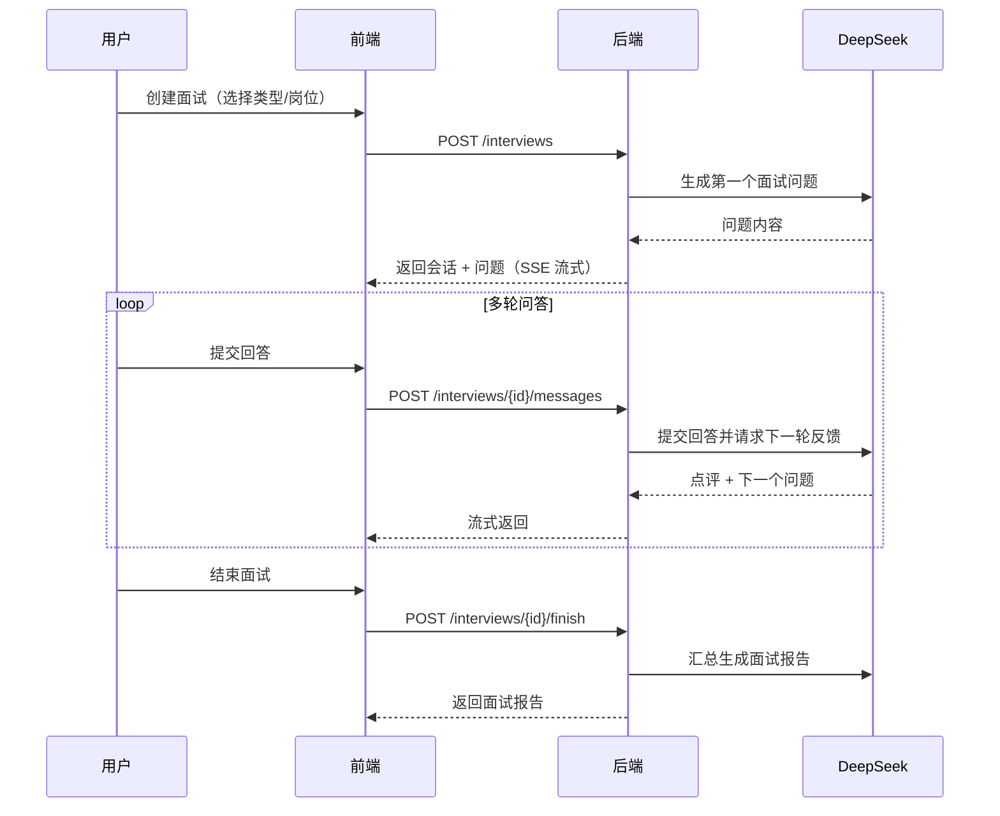
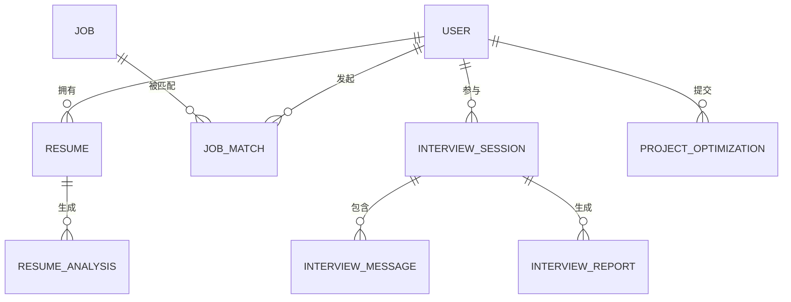

# AI Resume Agent

> 面向大学生的 AI 求职辅助平台：简历分析 · 岗位匹配 · AI 模拟面试 · 项目经历优化

## 技术栈

| 层次 | 技术 |
| --- | --- |
| 前端 | Vue 3 + Vite + Element Plus + Pinia + TypeScript |
| 后端 | Spring Boot 3.x + MyBatis-Plus + Spring Security + JWT |
| 数据库 | MySQL 8.x |
| AI | DeepSeek API（支持流式输出） |
| 部署 | Docker + Nginx |

## 核心功能

- 📄 **简历分析**：上传简历，AI 生成评分、优缺点与改进建议
- 🎯 **岗位匹配**：浏览岗位，AI 计算匹配度并输出差距分析
- 🎤 **AI 模拟面试**：多轮问答训练，结束后生成面试报告
- ✨ **项目经历优化**：按 STAR 法则改写项目描述，补充量化指标
- 🛠 **管理后台**：用户管理、岗位管理、AI 配置与数据统计

## 文档

- [软件需求规格说明书](docs/requirement.md)
- [数据库建表脚本](docs/sql/schema.sql)
- [示例岗位数据](docs/sql/seed_jobs.sql)

## 项目结构

```
AI-Resume-Agent/
├── backend/          # Spring Boot 后端
│   └── src/main/
│       ├── java/com/ai/resumeagent/
│       │   ├── common/      # 统一响应与全局异常
│       │   ├── config/      # Security / MyBatis-Plus 配置
│       │   ├── controller/  # 接口层
│       │   ├── dto/         # 请求/响应对象
│       │   ├── entity/      # 实体
│       │   ├── mapper/      # MyBatis-Plus Mapper
│       │   ├── security/    # JWT 鉴权
│       │   └── service/     # 业务层
│       └── resources/       # 配置文件（敏感配置不提交）
├── frontend/         # Vue3 前端
│   └── src/
│       ├── api/       # Axios 封装与接口
│       ├── router/    # 路由
│       ├── stores/    # Pinia 状态
│       ├── utils/     # 工具
│       └── views/     # 页面
└── docs/             # 需求文档与 SQL
```

## 快速开始

### 环境要求

- JDK 17+ / Maven 3.9+
- Node.js 18+ / npm
- MySQL 8.x

### 1. 初始化数据库

```bash
mysql -u root -p < docs/sql/schema.sql
# 可选：导入示例岗位数据（开发演示用）
mysql -u root -p < docs/sql/seed_jobs.sql
```

### 2. 启动后端

```bash
cd backend
# 复制配置模板并修改数据库密码等本地配置
copy src/main/resources/application-example.yml src/main/resources/application-dev.yml
mvn spring-boot:run
```

后端默认运行在 `http://localhost:8080`，API 前缀为 `/api/v1`。

> **AI 分析需要配置 DeepSeek API Key**：在 `backend/src/main/resources/application-dev.yml` 中填写 `deepseek.api-key`，或设置环境变量 `DEEPSEEK_API_KEY`。未配置时，简历分析会返回明确提示，不影响其他功能。

### 3. 启动前端

```bash
cd frontend
npm install
npm run dev
```

前端默认运行在 `http://localhost:5173`，已配置 `/api` 代理转发到后端。

## 当前进度

- [x] M1 项目初始化：前后端脚手架、数据库建表、统一响应与异常处理、JWT 注册登录
- [x] M2 简历模块：简历上传与解析（PDF/Word/TXT）、DeepSeek AI 分析报告
- [x] M3 岗位匹配：岗位筛选分页、AI 匹配度/理由/技能差距、匹配历史
- [ ] M4 模拟面试
- [ ] M5 项目优化 + 管理后台
- [ ] M6 测试与上线

---

# AI Resume Agent 软件需求规格说明书

> 版本：v0.1（初稿） ｜ 日期：2026-08-03 ｜ 状态：待评审

## 目录

1. [项目背景](#1-项目背景)
2. [用户角色分析](#2-用户角色分析)
3. [功能需求](#3-功能需求)
4. [非功能需求](#4-非功能需求)
5. [系统架构设计](#5-系统架构设计)
6. [数据库设计初稿](#6-数据库设计初稿)
7. [API 接口设计初稿](#7-api-接口设计初稿)
8. [后续开发计划](#8-后续开发计划)

---

## 1. 项目背景

### 1.1 项目概述

AI Resume Agent 是一个面向大学生的 AI 求职辅助平台，覆盖「简历分析 → 岗位匹配 → 模拟面试 → 项目经历优化」的完整求职链路。平台基于大语言模型（LLM）能力，通过接入 DeepSeek API 实现智能分析，为每位学生提供个性化的求职诊断与训练，帮助其提升简历质量、明确投递方向、并提前演练面试。

### 1.2 行业背景与痛点

当前大学生求职主要面临以下问题：

| 痛点 | 具体表现 | AI 可提供的帮助 |
| --- | --- | --- |
| 简历质量参差不齐 | 项目经历描述平淡、缺乏数据量化、重点不突出 | 基于 STAR 法则的诊断与改写建议 |
| 岗位匹配盲目 | 海投效率低，不知道自己的简历适合什么岗位 | 简历与岗位的智能匹配评分与差距分析 |
| 面试经验不足 | 缺乏真实面试场景训练，紧张、表达不清晰 | 多轮 AI 模拟面试与逐题点评 |
| 缺乏专业指导 | 校内资源有限，难以获得个性化反馈 | 7×24 小时 AI 求职教练 |

### 1.3 项目目标

1. **简历提效**：让学生在 5 分钟内获得简历的 AI 诊断报告和具体修改建议。
2. **精准匹配**：基于简历内容与学生偏好，推荐匹配度高的岗位并说明理由。
3. **面试训练**：提供真实感的多轮模拟面试，并生成可复盘的面试报告。
4. **项目升华**：将普通项目描述优化为符合 STAR 法则、具备量化指标的亮眼经历。
5. **快速落地**：采用主流前后端技术栈，MVP 可在 6 周内上线验证。

### 1.4 术语表

| 术语 | 说明 |
| --- | --- |
| STAR 法则 | 描述经历的经典框架：Situation（背景）、Task（任务）、Action（行动）、Result（结果） |
| 匹配度 | 简历内容与岗位要求之间的综合相似度评分（0~100） |
| AI 会话 | 一次模拟面试从开始到结束的完整对话过程 |
| Token | 大语言模型的输入/输出计数单位，用于计费与限流 |
| MVP | Minimum Viable Product，最小可行产品 |

---

## 2. 用户角色分析

### 2.1 角色总览

| 角色 | 描述 | 核心诉求 |
| --- | --- | --- |
| 求职学生 | 平台主要使用者，注册后使用全部核心功能 | 简历诊断、岗位推荐、面试训练、项目优化 |
| 系统管理员 | 平台运营与维护人员 | 用户管理、岗位数据维护、AI 配置、数据统计 |

### 2.2 求职学生（Student）

主要用例：

- 注册 / 登录账号，完善个人教育与求职偏好信息；
- 上传 PDF / Word / 文本简历，查看解析结果；
- 发起简历 AI 分析，查看评分、优缺点和改进建议；
- 浏览岗位，发起匹配并查看匹配报告；
- 创建模拟面试会话，进行多轮问答并查看面试报告；
- 提交项目经历，获取 STAR 优化后的文案与建议；
- 查看历史记录（简历、匹配、面试、优化）。

### 2.3 系统管理员（Admin）

主要用例：

- 管理用户账号（查看、禁用/启用、删除违规账号）；
- 维护岗位信息（新增、编辑、上下架）；
- 配置 DeepSeek API 密钥、模型、温度、限流等参数；
- 查看平台使用统计（用户数、请求量、AI 调用量等）。

### 2.4 权限矩阵

| 功能模块 | 求职学生 | 系统管理员 |
| --- | --- | --- |
| 注册 / 登录 / 个人信息 | ✅ | ✅ |
| 简历上传与管理 | ✅ | ❌ |
| 简历 AI 分析 | ✅ | ❌ |
| 岗位浏览 | ✅ | ✅ |
| 岗位匹配 | ✅ | ❌ |
| 岗位管理（增删改） | ❌ | ✅ |
| AI 模拟面试 | ✅ | ❌ |
| 项目经历优化 | ✅ | ❌ |
| 用户管理 | ❌ | ✅ |
| AI 配置 | ❌ | ✅ |
| 数据统计 | ❌ | ✅ |

---

## 3. 功能需求

### 3.1 功能模块总览



### 3.2 用户与认证模块

| 编号 | 需求描述 | 优先级 |
| --- | --- | --- |
| FR-001 | 支持邮箱/手机号注册，密码采用加密存储 | P0 |
| FR-002 | 支持账号密码登录，签发 JWT Token，Token 过期时间可配置 | P0 |
| FR-003 | 用户可维护个人资料：姓名、学校、专业、学历、毕业年份、求职意向 | P0 |
| FR-004 | 支持修改密码（需验证原密码） | P1 |
| FR-005 | 支持头像上传（可选） | P2 |

### 3.3 简历管理模块

| 编号 | 需求描述 | 优先级 |
| --- | --- | --- |
| FR-006 | 支持上传 PDF、Word（.doc/.docx）、TXT 格式简历，单文件 ≤ 10MB | P0 |
| FR-007 | 上传后自动解析简历文本内容，供后续 AI 分析使用 | P0 |
| FR-008 | 简历列表展示（文件名、上传时间、解析状态），支持删除 | P0 |
| FR-009 | 每名用户最多保存 10 份简历 | P1 |

### 3.4 简历智能分析模块

| 编号 | 需求描述 | 优先级 |
| --- | --- | --- |
| FR-010 | 对指定简历调用 DeepSeek 生成分析报告：综合评分（0~100）、内容、结构、关键词、量化程度等维度评分 | P0 |
| FR-011 | 输出简历优点、不足、具体改进建议（含示例改写） | P0 |
| FR-012 | 分析结果持久化，历史报告可重复查看 | P0 |
| FR-013 | 支持一键重新生成分析（消耗 AI 额度需提示） | P1 |

### 3.5 岗位匹配模块

| 编号 | 需求描述 | 优先级 |
| --- | --- | --- |
| FR-014 | 岗位列表支持按关键词、城市、行业、薪资范围筛选与分页 | P0 |
| FR-015 | 用户可对指定岗位发起匹配，生成匹配度评分（0~100） | P0 |
| FR-016 | 匹配报告包含：匹配理由、技能差距、建议补充的要点 | P0 |
| FR-017 | 匹配记录存入历史，支持重新查看 | P1 |

### 3.6 AI 模拟面试模块

| 编号 | 需求描述 | 优先级 |
| --- | --- | --- |
| FR-018 | 用户可创建面试会话，选择面试类型（通用/技术/行为）或关联岗位，AI 按职位生成题目 | P0 |
| FR-019 | 多轮问答：AI 提问 → 用户回答 → AI 追问/点评，支持流式输出提升体验 | P0 |
| FR-020 | 会话结束（主动结束或达到轮次上限）后生成面试报告 | P0 |
| FR-021 | 面试报告包含：综合评分、各维度评分、逐题点评、整体总结与改进建议 | P0 |
| FR-022 | 支持查看历史面试会话与报告 | P1 |

### 3.7 项目经历优化模块

| 编号 | 需求描述 | 优先级 |
| --- | --- | --- |
| FR-023 | 用户输入项目名称、角色、时间、原始描述，AI 按 STAR 法则结构化改写 | P0 |
| FR-024 | 输出优化后的完整文案、STAR 四要素拆解、量化与关键词建议 | P0 |
| FR-025 | 支持「一键复制」优化结果，优化记录可保存与查看 | P1 |

### 3.8 管理后台模块

| 编号 | 需求描述 | 优先级 |
| --- | --- | --- |
| FR-026 | 用户列表：搜索、分页、禁用/启用、删除 | P1 |
| FR-027 | 岗位管理：新增、编辑、上下架、删除岗位 | P1 |
| FR-028 | AI 配置管理：维护 DeepSeek API Key、模型名、温度、最大 Token、限流阈值 | P1 |
| FR-029 | 数据统计：注册用户数、活跃用户、简历分析次数、面试次数、AI Token 消耗 | P2 |

---

## 4. 非功能需求

### 4.1 性能需求

| 指标 | 目标值 |
| --- | --- |
| 常规业务接口（登录、列表、详情） | P95 响应时间 ≤ 500ms |
| AI 分析类接口 | 非流式 ≤ 30s；模拟面试对话采用流式输出，首字 ≤ 3s |
| 系统并发 | 支持 ≥ 100 并发在线用户 |
| 数据库查询 | 单表查询走索引，避免全表扫描 |

### 4.2 安全需求

- 密码使用 BCrypt 加密存储，禁止明文保存；
- 所有业务接口使用 JWT 鉴权，敏感操作校验角色权限；
- 生产环境强制 HTTPS，传输层加密；
- AI 请求中不传递密码、手机号等无关敏感字段；简历内容仅用于本人授权的分析；
- 防止 SQL 注入（MyBatis-Plus 预编译）、XSS 攻击、越权访问；
- 对 DeepSeek API Key 做服务端加密存储，禁止返回前端。

### 4.3 可用性需求

- 系统目标可用性 ≥ 99.5%；
- 支持应用无状态水平扩展，数据库可备份与恢复；
- DeepSeek 接口异常时返回友好提示并支持重试，不导致系统崩溃。

### 4.4 可维护性与可扩展性

- 后端采用分层架构（Controller / Service / Mapper），职责清晰；
- AI 调用抽象为统一接口（如 `AiClient`），后续可平滑替换或新增模型厂商；
- 关键业务埋点日志，便于问题排查与统计；
- 提供统一的异常处理与统一响应格式。

### 4.5 易用性需求

- 页面采用响应式布局，适配主流 PC 分辨率；
- AI 分析过程展示 loading 与进度提示，长任务不阻塞页面；
- 所有操作有明确成功/失败反馈，错误信息对用户友好；
- 新用户首次进入提供功能引导（可选）。

### 4.6 兼容性需求

- 前端支持 Chrome、Edge、Safari 最近两个主要版本；
- 简历解析支持 PDF、.doc、.docx、TXT 四种常见格式；
- 时间统一使用北京时间（Asia/Shanghai）展示。

---

## 5. 系统架构设计

### 5.1 总体架构



### 5.2 技术选型

| 层次 | 技术 | 说明 |
| --- | --- | --- |
| 前端 | Vue 3 + Vite + TypeScript | 主流组合，开发效率高 |
| 前端 UI | Element Plus | 企业级组件库，适合管理类界面 |
| 前端状态 | Pinia + Vue Router + Axios | 状态管理、路由、HTTP 请求 |
| 后端 | Spring Boot 3.x + Java 17 | 稳定成熟的企业级框架 |
| ORM | MyBatis-Plus | 单表 CRUD 免写 SQL，性能可控 |
| 鉴权 | Spring Security + JWT | 无状态认证 |
| 数据库 | MySQL 8.x | 主数据存储 |
| 缓存（可选） | Redis | 会话缓存、AI 限流计数 |
| AI 接口 | DeepSeek API | OpenAI 兼容协议，支持流式输出 |
| 部署 | Docker + Nginx | 容器化部署，前后端分离 |

### 5.3 后端分层设计



AI 调用采用策略模式：定义 `AiClient` 接口（`chat(prompt)`、`chatStream(prompt, callback)`），当前由 `DeepSeekAiClient` 实现，后续可扩展其他模型。

### 5.4 关键业务流程

**简历分析流程**



**模拟面试流程**



---

## 6. 数据库设计初稿

### 6.1 ER 关系概览



> 说明：数据库统一使用 `utf8mb4` 字符集；所有表含 `created_at`、`updated_at`；JSON 类型字段使用 MySQL 8 原生 JSON。

### 6.2 表结构设计

#### 6.2.1 `user` 用户表

| 字段 | 类型 | 约束 | 说明 |
| --- | --- | --- | --- |
| id | BIGINT | PK, AUTO_INCREMENT | 用户 ID |
| username | VARCHAR(50) | UNIQUE, NOT NULL | 用户名 |
| password | VARCHAR(100) | NOT NULL | BCrypt 加密密码 |
| email | VARCHAR(100) | UNIQUE | 邮箱 |
| phone | VARCHAR(20) | | 手机号 |
| avatar | VARCHAR(255) | | 头像 URL |
| school | VARCHAR(100) | | 学校 |
| major | VARCHAR(100) | | 专业 |
| education | VARCHAR(20) | | 学历（本科/硕士/博士） |
| graduation_year | INT | | 毕业年份 |
| job_intention | VARCHAR(255) | | 求职意向（岗位方向） |
| role | TINYINT | NOT NULL, DEFAULT 0 | 0=学生，1=管理员 |
| status | TINYINT | NOT NULL, DEFAULT 1 | 0=禁用，1=正常 |

#### 6.2.2 `resume` 简历表

| 字段 | 类型 | 约束 | 说明 |
| --- | --- | --- | --- |
| id | BIGINT | PK, AUTO_INCREMENT | 简历 ID |
| user_id | BIGINT | FK → user.id, INDEX | 所属用户 |
| file_name | VARCHAR(255) | NOT NULL | 原始文件名 |
| file_url | VARCHAR(255) | NOT NULL | 存储路径 |
| file_type | VARCHAR(20) | | 文件类型（pdf/doc/docx/txt） |
| file_size | BIGINT | | 文件大小（字节） |
| parsed_content | LONGTEXT | | 解析出的简历文本 |
| status | TINYINT | NOT NULL, DEFAULT 0 | 0=待解析，1=解析中，2=已完成，3=失败 |

#### 6.2.3 `resume_analysis` 简历分析报告表

| 字段 | 类型 | 约束 | 说明 |
| --- | --- | --- | --- |
| id | BIGINT | PK, AUTO_INCREMENT | 分析 ID |
| resume_id | BIGINT | FK → resume.id, INDEX | 关联简历 |
| total_score | INT | | 综合评分（0~100） |
| dimension_scores | JSON | | 各维度评分（内容/结构/关键词/量化等） |
| strengths | TEXT | | 优点 |
| weaknesses | TEXT | | 不足 |
| suggestions | TEXT | | 改进建议 |
| raw_ai_response | LONGTEXT | | AI 原始返回（排查用） |
| status | TINYINT | DEFAULT 1 | 1=成功，0=失败 |

#### 6.2.4 `job` 岗位表

| 字段 | 类型 | 约束 | 说明 |
| --- | --- | --- | --- |
| id | BIGINT | PK, AUTO_INCREMENT | 岗位 ID |
| title | VARCHAR(100) | NOT NULL | 岗位名称 |
| company | VARCHAR(100) | NOT NULL | 公司名称 |
| industry | VARCHAR(50) | | 所属行业 |
| location | VARCHAR(100) | | 工作地点 |
| salary_min | INT | | 薪资下限（K） |
| salary_max | INT | | 薪资上限（K） |
| education_requirement | VARCHAR(20) | | 学历要求 |
| experience_requirement | VARCHAR(20) | | 经验要求 |
| skills | JSON | | 技能要求列表 |
| job_description | LONGTEXT | | 岗位描述 |
| status | TINYINT | DEFAULT 1 | 0=下架，1=上架 |

#### 6.2.5 `job_match` 岗位匹配记录表

| 字段 | 类型 | 约束 | 说明 |
| --- | --- | --- | --- |
| id | BIGINT | PK, AUTO_INCREMENT | 匹配 ID |
| user_id | BIGINT | FK → user.id, INDEX | 用户 |
| job_id | BIGINT | FK → job.id, INDEX | 岗位 |
| match_score | INT | | 匹配度（0~100） |
| match_reasons | JSON | | 匹配理由列表 |
| skill_gaps | JSON | | 技能差距列表 |

#### 6.2.6 `interview_session` 面试会话表

| 字段 | 类型 | 约束 | 说明 |
| --- | --- | --- | --- |
| id | BIGINT | PK, AUTO_INCREMENT | 会话 ID |
| user_id | BIGINT | FK → user.id, INDEX | 用户 |
| job_id | BIGINT | FK → job.id, 可空 | 关联岗位（可选） |
| interview_type | VARCHAR(50) | NOT NULL | 类型：general/technical/behavioral |
| title | VARCHAR(100) | | 会话标题 |
| status | TINYINT | DEFAULT 0 | 0=进行中，1=已完成，2=已中断 |
| current_round | INT | DEFAULT 0 | 当前轮次 |

#### 6.2.7 `interview_message` 面试消息表

| 字段 | 类型 | 约束 | 说明 |
| --- | --- | --- | --- |
| id | BIGINT | PK, AUTO_INCREMENT | 消息 ID |
| session_id | BIGINT | FK → interview_session.id, INDEX | 所属会话 |
| role | VARCHAR(10) | NOT NULL | user / assistant |
| content | LONGTEXT | NOT NULL | 消息内容 |
| round | INT | | 所属轮次 |

#### 6.2.8 `interview_report` 面试报告表

| 字段 | 类型 | 约束 | 说明 |
| --- | --- | --- | --- |
| id | BIGINT | PK, AUTO_INCREMENT | 报告 ID |
| session_id | BIGINT | FK → interview_session.id, UNIQUE | 关联会话 |
| total_score | INT | | 综合评分 |
| dimension_scores | JSON | | 维度评分（表达/内容/逻辑/专业度） |
| question_reviews | JSON | | 逐题点评 |
| summary | TEXT | | 整体总结 |
| suggestions | TEXT | | 改进建议 |

#### 6.2.9 `project_optimization` 项目优化记录表

| 字段 | 类型 | 约束 | 说明 |
| --- | --- | --- | --- |
| id | BIGINT | PK, AUTO_INCREMENT | 优化 ID |
| user_id | BIGINT | FK → user.id, INDEX | 用户 |
| project_name | VARCHAR(100) | | 项目名称 |
| role | VARCHAR(50) | | 担任角色 |
| original_content | TEXT | NOT NULL | 用户原始描述 |
| optimized_content | TEXT | | STAR 优化后文案 |
| star_content | JSON | | STAR 四要素拆解 |
| suggestions | TEXT | | 量化与关键词建议 |

#### 6.2.10 `ai_config` AI 配置表

| 字段 | 类型 | 约束 | 说明 |
| --- | --- | --- | --- |
| id | BIGINT | PK, AUTO_INCREMENT | 配置 ID |
| config_key | VARCHAR(50) | UNIQUE, NOT NULL | 配置键（api_key/model/temperature 等） |
| config_value | TEXT | | 配置值（敏感值加密存储） |
| description | VARCHAR(255) | | 配置说明 |

### 6.3 索引与设计要点

- 外键字段（`user_id`、`job_id`、`resume_id`、`session_id`）均建立普通索引；
- `user.username`、`user.email` 唯一索引；
- `interview_report.session_id` 唯一索引（一个会话仅一份报告）；
- 文本大字段（`parsed_content`、`job_description`）与高频查询字段分表/分列存放，避免拖慢主查询；
- AI 原始返回单独存放，方便后续排查与数据回放。

---

## 7. API 接口设计初稿

### 7.1 通用规范

- **Base URL**：`/api/v1`
- **鉴权方式**：除注册/登录外，均需在请求头携带 `Authorization: Bearer <JWT>`
- **统一响应格式**：

```json
{
  "code": 0,
  "message": "success",
  "data": {}
}
```

- **分页参数**：`page`（从 1 开始）、`size`（默认 10，最大 50）
- **AI 流式接口**：使用 `text/event-stream`（SSE），事件格式 `data: {json}`，以 `[DONE]` 结束

### 7.2 接口清单

#### 认证模块

| 方法 | 路径 | 说明 | 权限 |
| --- | --- | --- | --- |
| POST | `/auth/register` | 用户注册 | 公开 |
| POST | `/auth/login` | 登录，返回 JWT | 公开 |
| GET | `/auth/profile` | 获取当前用户信息 | 登录 |
| PUT | `/auth/profile` | 更新个人资料 | 登录 |
| PUT | `/auth/password` | 修改密码 | 登录 |

#### 简历模块

| 方法 | 路径 | 说明 | 权限 |
| --- | --- | --- | --- |
| POST | `/resumes` | 上传简历（multipart/form-data） | 登录 |
| GET | `/resumes` | 简历列表 | 登录 |
| GET | `/resumes/{id}` | 简历详情（含解析文本） | 本人 |
| DELETE | `/resumes/{id}` | 删除简历 | 本人 |
| POST | `/resumes/{id}/analyze` | 触发 AI 简历分析 | 本人 |
| GET | `/resumes/{id}/analysis` | 获取分析报告 | 本人 |

#### 岗位模块

| 方法 | 路径 | 说明 | 权限 |
| --- | --- | --- | --- |
| GET | `/jobs` | 岗位列表（分页 + 筛选） | 登录 |
| GET | `/jobs/{id}` | 岗位详情 | 登录 |
| POST | `/jobs/{id}/match` | 发起岗位匹配 | 登录 |
| GET | `/matches` | 我的匹配历史 | 本人 |
| POST | `/jobs` | 新增岗位 | 管理员 |
| PUT | `/jobs/{id}` | 编辑岗位 | 管理员 |
| DELETE | `/jobs/{id}` | 删除岗位 | 管理员 |

#### 模拟面试模块

| 方法 | 路径 | 说明 | 权限 |
| --- | --- | --- | --- |
| POST | `/interviews` | 创建面试会话（返回首题，SSE） | 登录 |
| GET | `/interviews` | 面试历史列表 | 本人 |
| GET | `/interviews/{id}` | 会话详情（含全部消息） | 本人 |
| POST | `/interviews/{id}/messages` | 提交回答，流式返回点评 + 下一题 | 本人 |
| POST | `/interviews/{id}/finish` | 结束面试并生成报告 | 本人 |
| GET | `/interviews/{id}/report` | 获取面试报告 | 本人 |

#### 项目优化模块

| 方法 | 路径 | 说明 | 权限 |
| --- | --- | --- | --- |
| POST | `/projects/optimize` | 提交项目描述，返回优化结果 | 登录 |
| GET | `/projects` | 优化历史列表 | 本人 |
| GET | `/projects/{id}` | 优化结果详情 | 本人 |

#### 管理后台模块

| 方法 | 路径 | 说明 | 权限 |
| --- | --- | --- | --- |
| GET | `/admin/users` | 用户列表（搜索/分页） | 管理员 |
| PUT | `/admin/users/{id}/status` | 禁用/启用用户 | 管理员 |
| GET | `/admin/stats` | 平台数据统计 | 管理员 |
| PUT | `/admin/ai-config` | 更新 AI 配置 | 管理员 |

### 7.3 关键接口示例

#### 7.3.1 用户登录

`POST /api/v1/auth/login`

```json
// 请求
{
  "username": "student001",
  "password": "123456"
}

// 响应
{
  "code": 0,
  "message": "success",
  "data": {
    "token": "eyJhbGciOiJIUzI1NiJ9...",
    "expiresIn": 7200,
    "user": {
      "id": 1,
      "username": "student001",
      "role": 0
    }
  }
}
```

#### 7.3.2 触发简历分析

`POST /api/v1/resumes/1/analyze`

```json
// 响应
{
  "code": 0,
  "message": "success",
  "data": {
    "analysisId": 12,
    "status": "processing"
  }
}
```

随后通过 `GET /api/v1/resumes/1/analysis` 轮询获取报告：

```json
{
  "code": 0,
  "message": "success",
  "data": {
    "resumeId": 1,
    "totalScore": 72,
    "dimensionScores": {
      "content": 70,
      "structure": 80,
      "keywords": 65,
      "quantification": 60
    },
    "strengths": ["教育背景优秀", "实习经历与目标岗位相关度高"],
    "weaknesses": ["项目经历缺乏数据支撑", "专业技能关键词覆盖不足"],
    "suggestions": [
      "使用 STAR 法则重写项目经历，补充量化指标（如：将响应时间降低 40%）",
      "在技能栏补充 Spring Boot、Redis 等关键词"
    ]
  }
}
```

#### 7.3.3 模拟面试提问（流式）

`POST /api/v1/interviews/5/messages`

```json
// 请求
{
  "content": "我在上一段实习中主要负责后端接口开发……"
}
```

```text
// 响应（SSE 流式）
data: {"type":"comment","content":"回答思路清晰，但缺少具体数据支撑。建议补充：接口日均调用量、QPS 优化效果。"}
data: {"type":"question","round":3,"content":"请描述一次你解决过的线上故障，并说明你的排查过程。"}
data: [DONE]
```

---

## 8. 后续开发计划

### 8.1 里程碑规划

| 阶段 | 周期 | 主要内容 | 交付物 |
| --- | --- | --- | --- |
| M1 项目初始化 | 第 1 周 | 前后端脚手架、数据库建表、统一响应与异常处理、注册登录 | 可运行的前后端骨架 |
| M2 简历模块 | 第 2 周 | 简历上传与解析、AI 分析流程、分析报告展示 | 简历分析 MVP |
| M3 岗位匹配 | 第 3 周 | 岗位数据管理、匹配算法与报告 | 岗位匹配功能 |
| M4 模拟面试 | 第 4 周 | 多轮对话（SSE 流式）、面试报告生成 | 模拟面试功能 |
| M5 项目优化 + 管理后台 | 第 5 周 | STAR 优化、管理后台、数据统计 | 完整功能闭环 |
| M6 测试与上线 | 第 6 周 | 功能/性能/安全测试、Docker 部署、上线 | 可公测的 V1.0 |

> 注：M2~M5 前后端可并行开发，单模块 1 周为紧凑估算；若人力充足，可进一步缩短总周期。

### 8.2 迭代路线图

- **MVP（V0.1）**：注册登录 + 简历上传与 AI 分析 + 基础岗位匹配；
- **V1.0**：模拟面试、项目优化、管理后台，完成核心闭环；
- **V1.x**：ATS 简历模板生成、面试复盘报告导出（PDF）、多模型切换；
- **V2.0（远期）**：企业端入驻发布岗位、求职社区、移动端适配、简历订阅式跟踪。

### 8.3 风险与对策

| 风险 | 影响 | 对策 |
| --- | --- | --- |
| DeepSeek API 费用与限流 | 成本上升、请求失败 | 结果缓存、请求限流、Token 用量统计与预警、失败重试与降级提示 |
| 简历解析准确率 | 影响 AI 分析质量 | 支持多格式、解析失败人工修正入口、保留原始文本 |
| 用户隐私与数据安全 | 合规风险、信任问题 | 敏感信息加密、用户可删除数据、隐私政策说明 |
| AI 输出不稳定 | 用户体验波动 | 结构化 Prompt + JSON 输出约束、结果二次校验、提供重新生成 |

### 8.4 验收标准（摘要）

- 注册登录、简历上传/分析、岗位匹配、模拟面试、项目优化五条核心链路可完整走通；
- AI 分析接口成功率 ≥ 95%，模拟面试流式首字响应 ≤ 3s；
- 常规接口 P95 ≤ 500ms，支持 100 并发；
- 通过基础安全审计（无明文密码、越权防护、注入防护）；
- 前后端均完成单元测试与关键路径集成测试。

---

> 本文档为初稿，随开发迭代持续更新。建议在 M1 结束后评审并补充详细用例与原型图。
